# Visita a la exposición de Historia de la Computación (MNACTEC)
 
## Introducción
 
Durante una visita al Museu Nacional de la Ciència i la Tècnica de Catalunya (Terrassa), recorrí la exposición dedicada a la historia de la computación.

Imagen de referencia del edificio del MNACTEC.
 
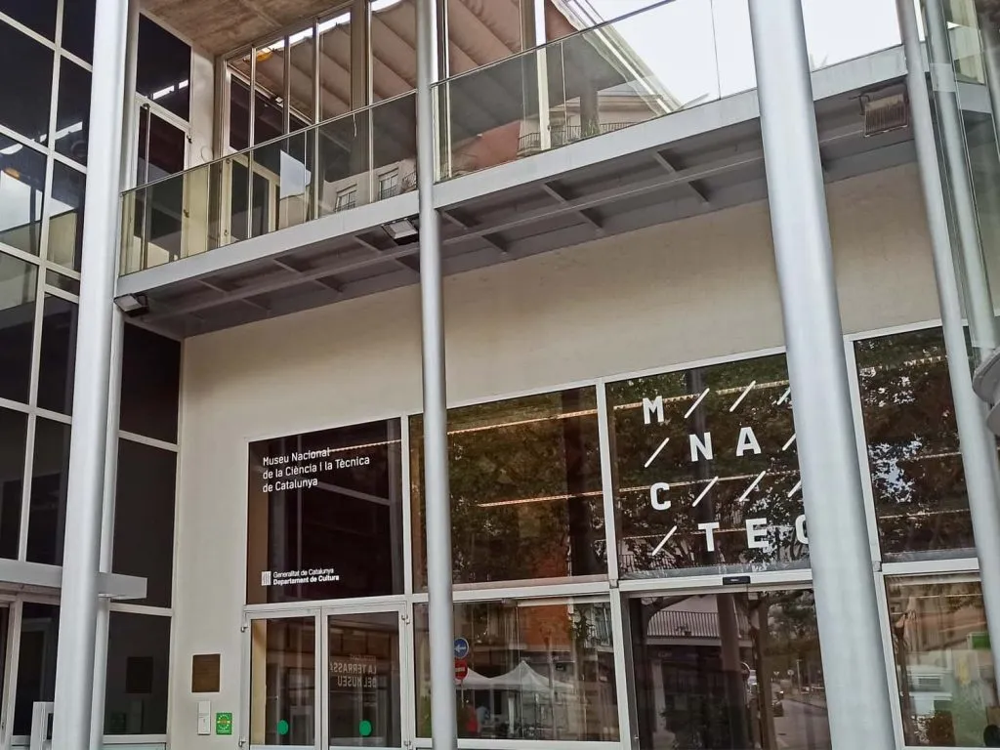

 
Como estudiante de soporte TI y microinformática, me resultó especialmente interesante observar la evolución del hardware, los sistemas de almacenamiento y las interfaces de usuario a lo largo de distintas generaciones.
 
## Objetivo de la visita
 
- Conocer la evolución histórica de la informática.
- Observar equipos reales de distintas épocas.
- Comprender mejor cómo ha evolucionado el hardware actual.
- Complementar mi formación técnica con una visión histórica del sector.
 
## Aspectos que más me llamaron la atención
 
- El enorme tamaño de algunos sistemas comparado con equipos actuales.
- La evolución de los dispositivos de almacenamiento.
- Los cambios en la interacción entre usuarios y ordenadores.
- La rapidez con la que ha avanzado la tecnología en pocas décadas.
 
## Galería fotográfica

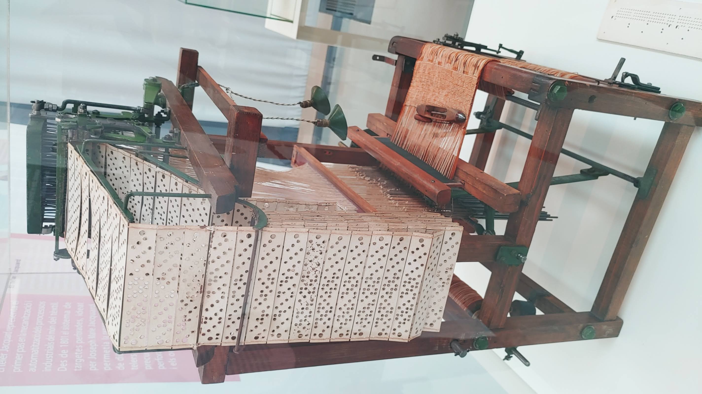

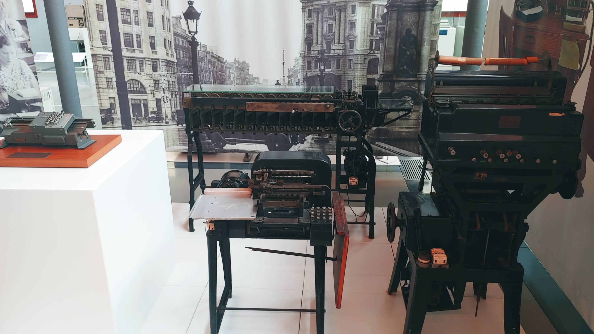

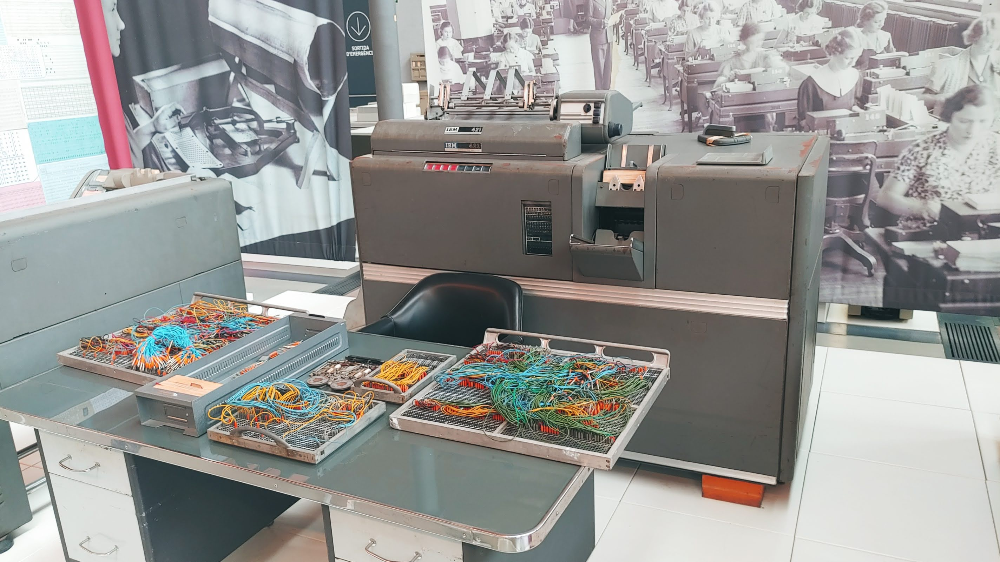

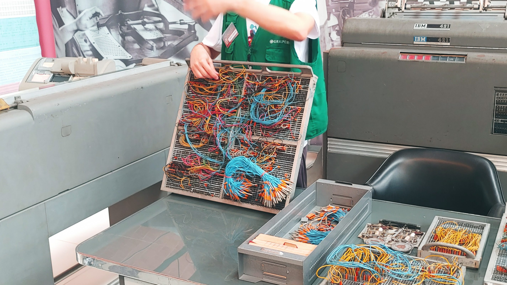

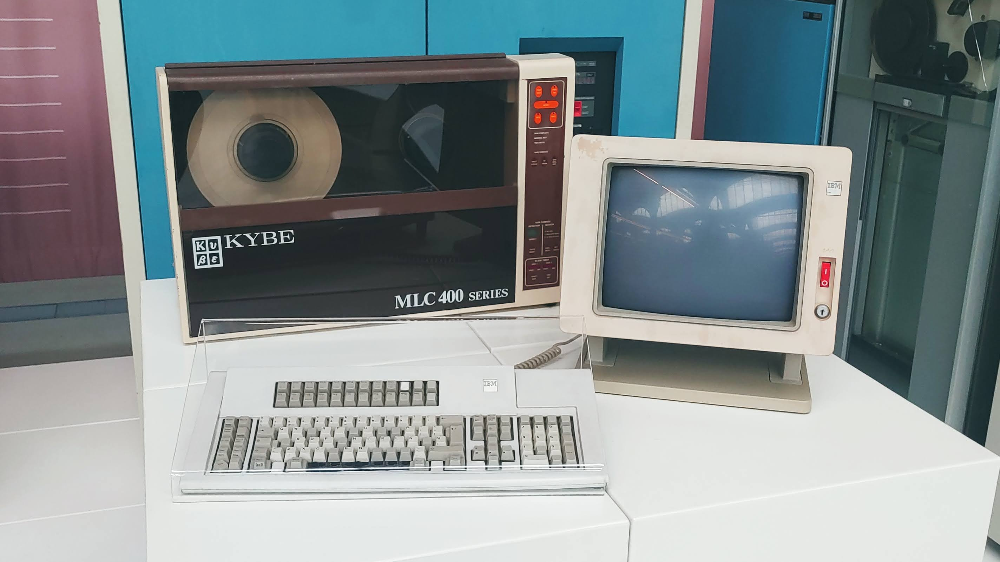

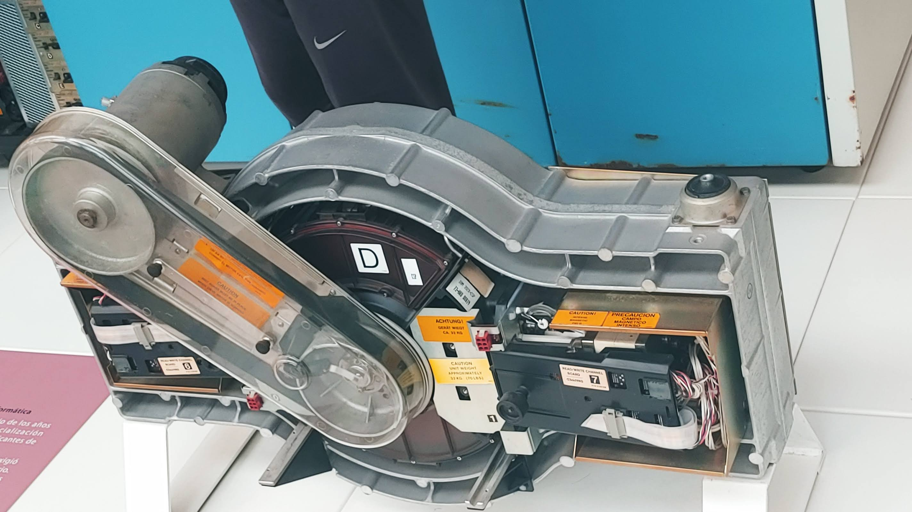

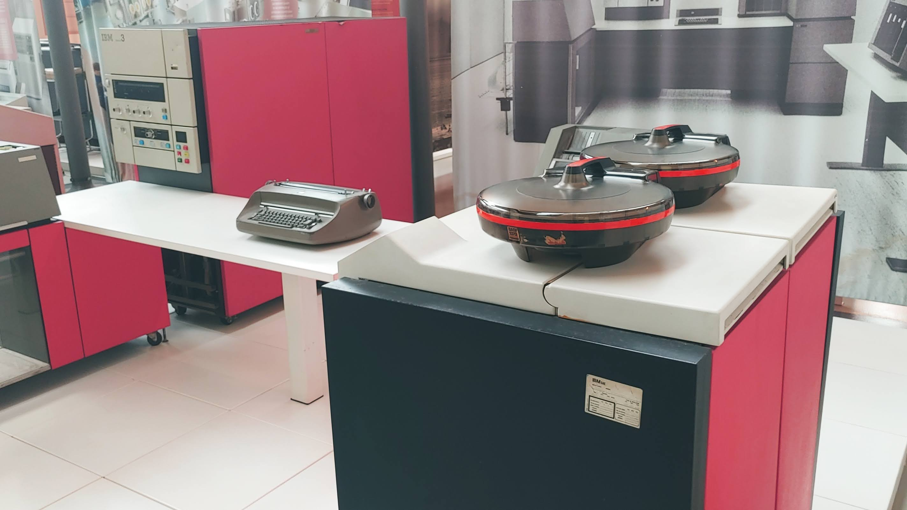

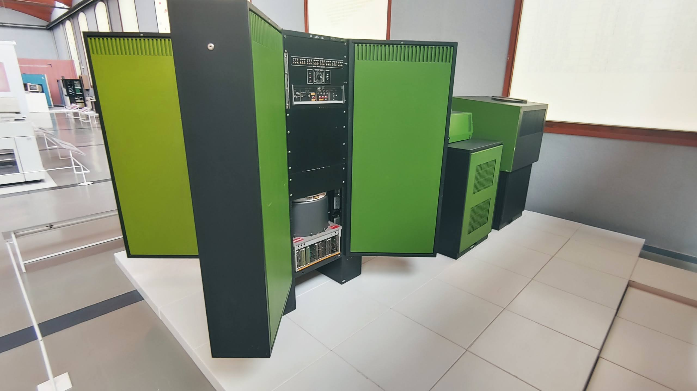

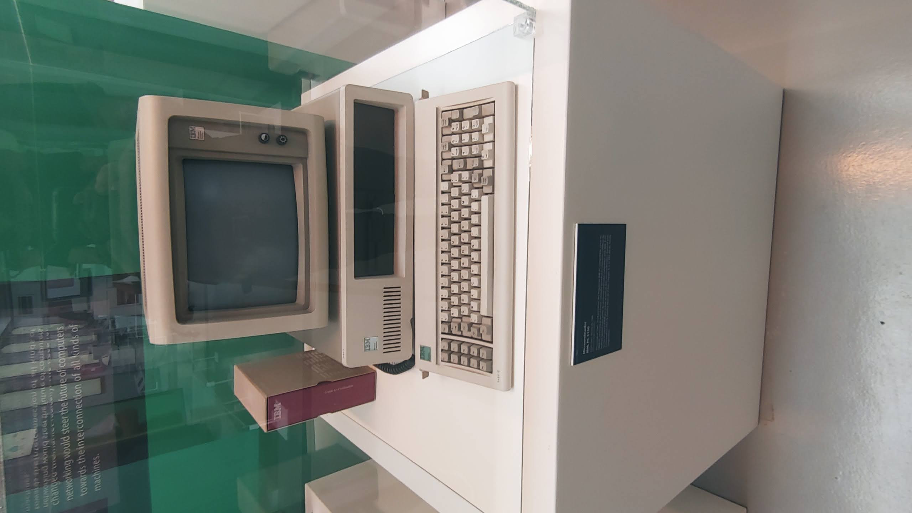

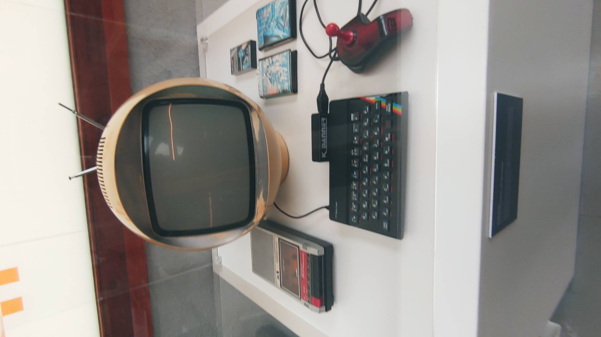

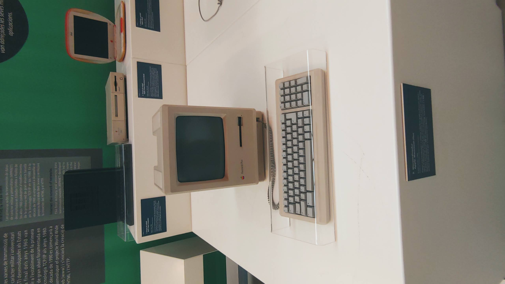

## Créditos
 
La imagen de la entrada del museo es una imagen de referencia obtenida de una fuente pública. El resto de fotografías corresponden a la visita realizada a la exposición.
